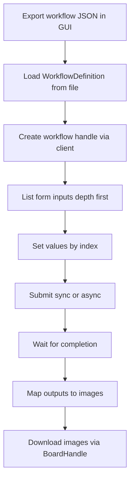

# InvokeAI Python Client Developer Guide — Overview

Purpose and audience
- Goal: enable developers to quickly understand how to use, extend, and maintain the InvokeAI Python Client, and how it relates to the upstream InvokeAI REST API surface.
- Audience: contributors and integrators familiar with Python who want to automate InvokeAI GUI workflows, add capabilities, or troubleshoot pipelines.

Project intent (what this client provides)
- Turn an InvokeAI GUI workflow export (JSON) into repeatable, high-throughput batch jobs.
- Provide strongly-typed workflow inputs discovered deterministically by depth-first traversal of the GUI Form.
- Submit executions (blocking or async) and map output-capable nodes to produced image names for post-processing.
- Manage boards and images for routing and retrieval.

When to use this client vs raw REST
- Prefer the client for: using GUI-authored workflows, stable input indexing, typed field access, quick submissions, output mapping.
- Prefer raw REST for: bespoke API exploration, queue analytics, non-workflow assets management, ops tooling, or when working outside the GUI Form concept.
  - See raw demos at [examples/raw-apis](examples/raw-apis)

Repository map (key locations)
- Client source (entry and layers)
  - src package: [src/invokeai_py_client](src/invokeai_py_client)
- End-to-end examples (client-centric)
  - Pipelines (GUI workflow based): [examples/pipelines](examples/pipelines)
- Raw REST examples (direct HTTP)
  - [examples/raw-apis](examples/raw-apis)
- Upstream API references
  - Endpoint list: [context/hints/invokeai-kb/invokeai-api-list.md](context/hints/invokeai-kb/invokeai-api-list.md)
  - OpenAPI JSON: [context/hints/invokeai-kb/invokeai-openapi.json](context/hints/invokeai-kb/invokeai-openapi.json)
- Project README
  - [README.md](README.md)
- Design notes and context
  - [context/design](context/design)

High-level usage flow (client)
- Create client and load workflow:
  - [Python.InvokeAIClient.from_url()](examples/pipelines/sdxl-text-to-image.py:129)
  - [Python.WorkflowDefinition.from_file()](examples/pipelines/sdxl-text-to-image.py:132)
  - [Python.client.workflow_repo.create_workflow()](examples/pipelines/sdxl-text-to-image.py:133)
- Optional: synchronize DNN model identifier fields to server-known records:
  - [Python.workflow_handle.sync_dnn_model()](examples/pipelines/sdxl-text-to-image.py:136)
- Discover inputs by deterministic pre-order traversal of the GUI Form:
  - [Python.workflow_handle.list_inputs()](examples/pipelines/sdxl-text-to-image.py:143)
- Retrieve typed fields by index and set values (index is the stable handle):
  - [Python.workflow_handle.get_input_value()](examples/pipelines/sdxl-text-to-image.py:224)
- Submit, wait, and map results:
  - [Python.workflow_handle.submit_sync()](examples/pipelines/sdxl-text-to-image.py:309)
  - [Python.workflow_handle.wait_for_completion_sync()](examples/pipelines/sdxl-text-to-image.py:312)
  - [Python.workflow_handle.map_outputs_to_images()](examples/pipelines/sdxl-text-to-image.py:328)
- Boards and image retrieval:
  - List boards: [Python.client.board_repo.list_boards()](examples/pipelines/sdxl-text-to-image.py:173)
  - Get board handle and download: [Python.client.board_repo.get_board_handle()](examples/pipelines/sdxl-text-to-image.py:347), [Python.BoardHandle.download_image()](examples/pipelines/sdxl-text-to-image.py:349)

Mermaid overview

Quickstart references (copy the pattern, then adapt indices to your workflow)
- Client and workflow setup
  - [Python.InvokeAIClient.from_url()](examples/pipelines/sdxl-text-to-image.py:129)
  - [Python.WorkflowDefinition.from_file()](examples/pipelines/sdxl-text-to-image.py:132)
  - [Python.client.workflow_repo.create_workflow()](examples/pipelines/sdxl-text-to-image.py:133)
- Model sync
  - [Python.workflow_handle.sync_dnn_model()](examples/pipelines/sdxl-text-to-image.py:136)
- Input discovery and value assignment by index
  - [Python.workflow_handle.list_inputs()](examples/pipelines/sdxl-text-to-image.py:143)
  - [Python.workflow_handle.get_input_value()](examples/pipelines/sdxl-text-to-image.py:224)
- Submit and map
  - [Python.workflow_handle.submit_sync()](examples/pipelines/sdxl-text-to-image.py:309)
  - [Python.workflow_handle.wait_for_completion_sync()](examples/pipelines/sdxl-text-to-image.py:312)
  - [Python.workflow_handle.map_outputs_to_images()](examples/pipelines/sdxl-text-to-image.py:328)
- Download images
  - [Python.client.board_repo.get_board_handle()](examples/pipelines/sdxl-text-to-image.py:347)
  - [Python.BoardHandle.download_image()](examples/pipelines/sdxl-text-to-image.py:349)

Choosing the right example
- SDXL text to image: smallest end-to-end reference
  - [examples/pipelines/sdxl-text-to-image.py](examples/pipelines/sdxl-text-to-image.py)
- FLUX image to image: adds uploading a source image then setting the image field
  - [examples/pipelines/flux-image-to-image.py](examples/pipelines/flux-image-to-image.py)
- SDXL to FLUX refine (multi-stage): demonstrates multiple board fields, append prompts, noise ratios, and extended output mapping
  - [examples/pipelines/sdxl-flux-refine.py](examples/pipelines/sdxl-flux-refine.py)
- Raw REST recipes (no client abstractions): queue, boards, images, upload
  - [examples/raw-apis/api-demo-boards.py](examples/raw-apis/api-demo-boards.py)
  - [examples/raw-apis/api-demo-job-queue.py](examples/raw-apis/api-demo-job-queue.py)
  - [examples/raw-apis/api-demo-latest-image.py](examples/raw-apis/api-demo-latest-image.py)
  - [examples/raw-apis/api-demo-upload-image.py](examples/raw-apis/api-demo-upload-image.py)
  - [examples/raw-apis/api-demo-starred-images.py](examples/raw-apis/api-demo-starred-images.py)

Key invariants in practice
- Inputs come only from fields placed in the GUI Form; indices are stable until the Form layout changes.
- The exported workflow JSON is immutable; the client substitutes values without altering graph structure.
- Board routing should be controlled by exposing board fields on output-capable nodes in the Form.
- Output mapping correlates produced images back to node ids and, if exposed, to the board input index for downstream association.

Upstream API surface (orientation)
- Submissions and queue management:
  - Enqueue and list queue items live under /api/v1/queue; see [context/hints/invokeai-kb/invokeai-api-list.md](context/hints/invokeai-kb/invokeai-api-list.md)
- Boards and images:
  - Boards: /api/v1/boards, Board image names: /api/v1/boards/{board_id}/image_names, Download image: /api/v1/images/i/{image_name}/full
- Models:
  - /api/v2/models and related endpoints assist with model metadata, lookup, and installation
- Full OpenAPI:
  - [context/hints/invokeai-kb/invokeai-openapi.json](context/hints/invokeai-kb/invokeai-openapi.json)

Next steps in this developer guide set
- 01-usage-pattern.md: step-by-step, index-centric workflow usage, boards, submission, mapping
- 02-architecture.md: modules, discovery system, submission pipeline, output mapping, invariants, extensibility points
- 03-upstream-apis.md: mapping of client operations to REST endpoints and common call flows
- 04-examples-index.md: walkthroughs for each example with what they illustrate
- 05-contributing-testing.md: dev setup, tests, invariants to preserve, PR checklist, and design references

Source of truth
- Project README: [README.md](README.md)
- API list summary: [context/hints/invokeai-kb/invokeai-api-list.md](context/hints/invokeai-kb/invokeai-api-list.md)