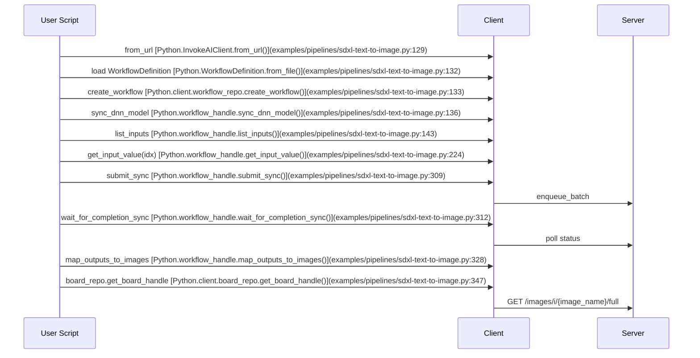

# InvokeAI Python Client — Usage Pattern

Goal
- Provide a step-by-step, index-centric guide for using the client to run GUI-authored workflows at scale.
- Focus on: loading a workflow, discovering ordered inputs, setting values with typed fields, selecting boards, submitting jobs, waiting/monitoring, and mapping outputs to images.

Prerequisites
- Running InvokeAI server (default http://127.0.0.1:9090).
- An exported workflow JSON from the GUI with the desired fields placed in the GUI Form.
- Access to the repository examples for concrete references.

Core pattern (step-by-step)

1) Create client and load a GUI-exported workflow
- Create a connected client:
  - [Python.InvokeAIClient.from_url()](examples/pipelines/sdxl-text-to-image.py:129)
- Load workflow JSON from disk and create a workflow handle:
  - [Python.WorkflowDefinition.from_file()](examples/pipelines/sdxl-text-to-image.py:132)
  - [Python.client.workflow_repo.create_workflow()](examples/pipelines/sdxl-text-to-image.py:133)

2) Optionally synchronize DNN model identifier fields
- Model names and hashes in a workflow may not match the server. Normalize with:
  - [Python.workflow_handle.sync_dnn_model()](examples/pipelines/sdxl-text-to-image.py:136)
- Example: prints resolution pairs when changes are applied:
  - [examples/pipelines/sdxl-text-to-image.py](examples/pipelines/sdxl-text-to-image.py)

3) Discover inputs — deterministic index ordering
- Inputs are discovered via depth-first traversal of the GUI Form tree. Indices are the single stable programmatic handle while the form layout is unchanged:
  - [Python.workflow_handle.list_inputs()](examples/pipelines/sdxl-text-to-image.py:143)
- Displaying index, label, field name, node, and required flag:
  - [examples/pipelines/sdxl-text-to-image.py](examples/pipelines/sdxl-text-to-image.py)

4) Retrieve typed fields by index and assign values
- Accessors are index-based, returning strongly-typed Ivk* field objects:
  - [Python.workflow_handle.get_input_value()](examples/pipelines/sdxl-text-to-image.py:224)
- Common types: IvkStringField, IvkIntegerField, IvkFloatField, IvkSchedulerField, IvkModelIdentifierField, IvkImageField, IvkBoardField.
- Minimal SDXL example of field assignment (prompts, dims, sampler):
  - [examples/pipelines/sdxl-text-to-image.py](examples/pipelines/sdxl-text-to-image.py)
- FLUX image-to-image assignment (includes image field):
  - [examples/pipelines/flux-image-to-image.py](examples/pipelines/flux-image-to-image.py)
- Multi-stage refine pattern:
  - [examples/pipelines/sdxl-flux-refine.py](examples/pipelines/sdxl-flux-refine.py)

Example snippet (indices are example-specific, discover via list_inputs first):
```python
# Retrieve + set common fields (see your discovered indices)
pos = wf.get_input_value(IDX_POS_PROMPT)   # [Python.workflow_handle.get_input_value()](examples/pipelines/sdxl-text-to-image.py:224)
neg = wf.get_input_value(IDX_NEG_PROMPT)   # [Python.workflow_handle.get_input_value()](examples/pipelines/sdxl-text-to-image.py:228)
width = wf.get_input_value(IDX_WIDTH)      # [Python.workflow_handle.get_input_value()](examples/pipelines/sdxl-text-to-image.py:232)
height = wf.get_input_value(IDX_HEIGHT)    # [Python.workflow_handle.get_input_value()](examples/pipelines/sdxl-text-to-image.py:236)
steps = wf.get_input_value(IDX_STEPS)      # [Python.workflow_handle.get_input_value()](examples/pipelines/sdxl-text-to-image.py:240)

# Set values if the field supports .value
if hasattr(pos, "value"): pos.value = "A cinematic sunset over snowy mountains"
if hasattr(neg, "value"): neg.value = "blurry, low quality"
if hasattr(width, "value"): width.value = 1024
if hasattr(height, "value"): height.value = 1024
if hasattr(steps, "value"): steps.value = 30
```

5) Board handling — routing outputs
- Best practice: expose the board field of your output-capable nodes in the GUI Form, then set that input programmatically.
- Dynamic discovery of the board input index:
  - [Python.next(...)](examples/pipelines/sdxl-text-to-image.py:163)
- List boards and resolve GUI name to API board_id:
  - [Python.client.board_repo.list_boards()](examples/pipelines/sdxl-text-to-image.py:173)
- Set board field by board_id (string) if the input is present:
  - [examples/pipelines/sdxl-text-to-image.py](examples/pipelines/sdxl-text-to-image.py)
- Uploading a source image for image-to-image pipelines and referencing its image_name:
  - [Python.BoardHandle.upload_image_data()](examples/pipelines/flux-image-to-image.py:220)

Example snippet (board selection):
```python
# Resolve a board id by GUI name (optional). Then set field via index.
boards = client.board_repo.list_boards(include_uncategorized=True)  # [Python.client.board_repo.list_boards()](examples/pipelines/sdxl-text-to-image.py:173)
resolved_board_id = "none"
for b in boards:
    if getattr(b, "board_name", "").lower() == "samples":
        resolved_board_id = getattr(b, "board_id", "none")

if BOARD_INPUT_INDEX is not None:
    field_board = wf.get_input_value(BOARD_INPUT_INDEX)  # [Python.workflow_handle.get_input_value()](examples/pipelines/sdxl-text-to-image.py:261)
    if hasattr(field_board, "value"):
        field_board.value = resolved_board_id
```

6) Submit and wait for completion
- Blocking submission and polling:
  - [Python.workflow_handle.submit_sync()](examples/pipelines/sdxl-text-to-image.py:309)
  - [Python.workflow_handle.wait_for_completion_sync()](examples/pipelines/sdxl-text-to-image.py:312)
- Execution modes are described in the README:
  - [README.md](README.md:268)
- Typical monitor callback logs status transitions during polling:
  - [examples/pipelines/sdxl-text-to-image.py](examples/pipelines/sdxl-text-to-image.py)
  - [examples/pipelines/flux-image-to-image.py](examples/pipelines/flux-image-to-image.py)

Example snippet (submit + wait):
```python
submission = wf.submit_sync()  # [Python.workflow_handle.submit_sync()](examples/pipelines/sdxl-text-to-image.py:309)
queue_item = wf.wait_for_completion_sync(    # [Python.workflow_handle.wait_for_completion_sync()](examples/pipelines/sdxl-text-to-image.py:312)
    poll_interval=2.0,
    timeout=240.0,
    progress_callback=lambda qi: print("Status:", qi.get("status")),
)
```

7) Map outputs to produced image names
- After completion, map form-exposed outputs to produced image filenames:
  - [Python.workflow_handle.map_outputs_to_images()](examples/pipelines/sdxl-text-to-image.py:328)
- Enumerate output-capable nodes with exposed board fields:
  - [Python.workflow_handle.list_outputs()](examples/pipelines/flux-image-to-image.py:285)
- Download images by board + image name:
  - [Python.client.board_repo.get_board_handle()](examples/pipelines/sdxl-text-to-image.py:347)
  - [Python.BoardHandle.download_image()](examples/pipelines/sdxl-text-to-image.py:349)

Example snippet (mapping + download first image):
```python
mappings = wf.map_outputs_to_images(queue_item)  # [Python.workflow_handle.map_outputs_to_images()](examples/pipelines/sdxl-text-to-image.py:328)
for m in mappings:
    image_names = m.get("image_names") or []
    if not image_names:
        continue
    board_id = m.get("board_id") or "none"
    first = image_names[0]
    bh = client.board_repo.get_board_handle(board_id)  # [Python.client.board_repo.get_board_handle()](examples/pipelines/sdxl-text-to-image.py:347)
    data = bh.download_image(first, full_resolution=True)  # [Python.BoardHandle.download_image()](examples/pipelines/sdxl-text-to-image.py:349)
    # Persist or process bytes in data
```

Index strategy and drift
- Indices reflect the GUI Form structure, not the graph topology.
- If you add, remove, or reorder fields/containers in the Form, indices can change; re-run list_inputs after any Form change and update your IDX_* constants.
- Simplify by avoiding containers when possible to keep top-to-bottom order intuitive.
- Keep a small snapshot of index-to-label mapping in your automation script for the current workflow export.

Execution modes
- Blocking, Async + Events, Hybrid Streaming as summarized in the README:
  - [README.md](README.md:268)
- The provided examples use blocking submission + wait-for-completion, with optional status callbacks.

Common tasks quick recipes

- SDXL text to image end-to-end:
  - [examples/pipelines/sdxl-text-to-image.py](examples/pipelines/sdxl-text-to-image.py)

- FLUX image to image:
  - Upload source image to a board, assign image field, submit, map, and save:
  - [examples/pipelines/flux-image-to-image.py](examples/pipelines/flux-image-to-image.py)

- Multi-output mapping and consolidated saving:
  - [examples/pipelines/sdxl-flux-refine.py](examples/pipelines/sdxl-flux-refine.py)

- Raw API exploration without the client abstractions:
  - Boards list, images in a board, uncategorized:
    - [examples/raw-apis/api-demo-boards.py](examples/raw-apis/api-demo-boards.py)
  - Latest image on a board (optimized):
    - [examples/raw-apis/api-demo-latest-image.py](examples/raw-apis/api-demo-latest-image.py)
  - Upload image via REST:
    - [examples/raw-apis/api-demo-upload-image.py](examples/raw-apis/api-demo-upload-image.py)
  - Queue examples:
    - [examples/raw-apis/api-demo-job-queue.py](examples/raw-apis/api-demo-job-queue.py)
    - [examples/raw-apis/api-demo-job-queue-hybrid.py](examples/raw-apis/api-demo-job-queue-hybrid.py)

Mermaid sequence (index-centric execution)


References
- Project README quickstart and invariants:
  - [README.md](README.md)
- Endpoint list and OpenAPI:
  - [context/hints/invokeai-kb/invokeai-api-list.md](context/hints/invokeai-kb/invokeai-api-list.md)
  - [context/hints/invokeai-kb/invokeai-openapi-v6.3.json](context/hints/invokeai-kb/invokeai-openapi-v6.3.json)
