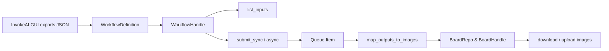
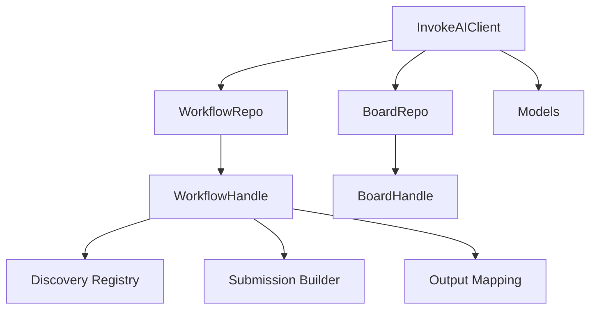

# InvokeAI Python Client — Architecture

Purpose
- Provide a clear mental model of modules, data flow, invariants, and extension points so contributors can confidently evolve the client without breaking public behavior.

Top-level architecture (layers)
- Client facade and repositories
  - Connects to InvokeAI server, exposes repositories for workflows, boards, models.
  - Entry points mirrored by examples:
    - [Python.InvokeAIClient.from_url()](examples/pipelines/sdxl-text-to-image.py:129)
    - [Python.client.workflow_repo.create_workflow()](examples/pipelines/sdxl-text-to-image.py:133)
- Workflow system
  - Loads a GUI-exported workflow JSON into a definition object and a runtime handle; discovers ordered inputs; builds submissions; correlates outputs.
  - [Python.WorkflowDefinition.from_file()](examples/pipelines/sdxl-text-to-image.py:132)
  - [Python.workflow_handle.list_inputs()](examples/pipelines/sdxl-text-to-image.py:143)
  - [Python.workflow_handle.submit_sync()](examples/pipelines/sdxl-text-to-image.py:309)
  - [Python.workflow_handle.map_outputs_to_images()](examples/pipelines/sdxl-text-to-image.py:328)
- Field system
  - Strongly-typed Ivk*Field classes represent concrete form fields (string, integer, float, scheduler enum, model identifier, image, board).
  - Open/closed detection via predicate → builder registry (no giant if/elif chains in user code).
- Boards & images
  - Board repository and board handle for listing, resolving IDs, uploads, and downloads.
  - [Python.client.board_repo.list_boards()](examples/pipelines/sdxl-text-to-image.py:173)
  - [Python.client.board_repo.get_board_handle()](examples/pipelines/sdxl-text-to-image.py:347)
  - [Python.BoardHandle.download_image()](examples/pipelines/sdxl-text-to-image.py:349)
- DNN models
  - Synchronization helpers align model fields to server-known records by name or base.
  - [Python.workflow_handle.sync_dnn_model()](examples/pipelines/sdxl-text-to-image.py:136)

Mermaid overview

Key design principles and invariants
- Source of truth: exported workflow JSON is treated as immutable input; only values are substituted at submission.
  - Reference: [README.md](README.md:37)
- Public handle stability: ordered inputs reflect GUI Form semantics (depth‑first, pre‑order), not graph topology; indices are the single stable programmatic handle while the Form layout is unchanged.
  - Reference: [README.md](README.md:63)
- Strong typing: Ivk*Field concrete class is stable post‑discovery; users set `.value` on typed field objects, avoiding dynamic type swaps.
  - Reference: [README.md](README.md:299)
- No hidden mutation: original definition is not mutated; a working copy is created for submission.
  - Reference: [README.md](README.md:41)

Workflow data flow
1) Load
   - [Python.WorkflowDefinition.from_file()](examples/pipelines/sdxl-text-to-image.py:132) returns a pure definition (raw JSON + helpers).
2) Instantiate runtime handle
   - [Python.client.workflow_repo.create_workflow()](examples/pipelines/sdxl-text-to-image.py:133) returns a handle bound to a server connection.
3) Discover inputs
   - [Python.workflow_handle.list_inputs()](examples/pipelines/sdxl-text-to-image.py:143) yields IvkWorkflowInput descriptors with input_index, label, field_name, node_name, and the typed field instance.
4) Set values
   - [Python.workflow_handle.get_input_value()](examples/pipelines/sdxl-text-to-image.py:224) → returns strongly-typed Ivk*Field; set `.value` where applicable.
5) Submit
   - [Python.workflow_handle.submit_sync()](examples/pipelines/sdxl-text-to-image.py:309) builds a submission graph by substituting only changed input values, then enqueues the batch.
6) Monitor and map
   - [Python.workflow_handle.wait_for_completion_sync()](examples/pipelines/sdxl-text-to-image.py:312) → returns queue item dict including status.
   - [Python.workflow_handle.map_outputs_to_images()](examples/pipelines/sdxl-text-to-image.py:328) correlates output-capable nodes (esp. those with board fields exposed in the Form) to produced image names.

Input discovery and field registry
- Input ordering: deterministic pre‑order (depth‑first) traversal over the GUI Form container tree:
  - Containers visited in appearance order; child fields top → bottom; nested containers recursively.
  - Reference: [README.md](README.md:65)
- Typed field detection: an open registry (predicate → builder) constructs concrete Ivk*Field instances from raw field metadata.
  - Benefits
    - Extensible without invasive core changes
    - Testable per-field rules
- Practical indexing guidance:
  - Avoid containers when possible to keep indices visually top → bottom.
  - Snapshot index → label mapping in scripts and re‑enumerate after Form changes.
  - Reference: [README.md](README.md:128)

Submission pipeline (immutable-substitution model)
- Steps
  1) Copy raw workflow JSON (no node/edge surgery)
  2) Substitute only values for indices that the user changed
  3) POST to enqueue_batch; queue/session IDs returned
- Rationale
  - Preserves fidelity to GUI semantics and reduces risk of graph drift
- Reference: [README.md](README.md:292)

Output mapping
- What is an output: a “board” field exposed in the Form for an output-capable node.
  - Enables two things:
    - Configure destination board at submit time
    - Post‑hoc mapping: node_id → list of produced image_names
- Mapping algorithm outline
  - Build node_id → input_index for board-exposed outputs
  - After completion, use session/queue runtime to resolve image outputs per node
  - Optionally invert to input_index → [image_names] for downstream consumption
- References
  - [examples/pipelines/sdxl-text-to-image.py](examples/pipelines/sdxl-text-to-image.py:328)
  - [README.md](README.md:153)

Boards & images module interactions
- Listing boards:
  - [Python.client.board_repo.list_boards()](examples/pipelines/sdxl-text-to-image.py:173) → /api/v1/boards/
- Resolving board_id by GUI name (warning: names not globally unique; first match wins in examples)
- Uploads (image-to-image assets):
  - [Python.BoardHandle.upload_image_data()](examples/pipelines/flux-image-to-image.py:220) → /api/v1/images/upload
- Downloads (post‑result retrieval):
  - [Python.BoardHandle.download_image()](examples/pipelines/sdxl-text-to-image.py:349) → /api/v1/images/i/{image_name}/full

DNN model synchronization
- Motivation: exported workflow may reference models not known to the server (name mismatch, different key, etc.)
- Synchronization strategy:
  - Try match by exact name; fallback to base/architecture.
- API correlation: /api/v2/models/ and /api/v2/models/get_by_attrs
- Reference:
  - [Python.workflow_handle.sync_dnn_model()](examples/pipelines/sdxl-text-to-image.py:136)
  - [context/hints/invokeai-kb/invokeai-api-list.md](context/hints/invokeai-kb/invokeai-api-list.md:12)

Execution modes
- Blocking: [Python.workflow_handle.submit_sync()](examples/pipelines/sdxl-text-to-image.py:309) + [Python.workflow_handle.wait_for_completion_sync()](examples/pipelines/sdxl-text-to-image.py:312)
- Async + events: see README execution modes for async and hybrid streaming variants.
  - Reference: [README.md](README.md:268)

Error handling and resilience
- Queue cancelation surfaced via wait_for_completion_sync exceptions; examples show explicit handling:
  - [examples/pipelines/sdxl-text-to-image.py](examples/pipelines/sdxl-text-to-image.py:317)
- Defensive field assignment: check for `.value` attribute; retain assertions for expected field types to catch drift early.
- Board listing and best-effort behaviors are guarded (warnings on failures in examples).

Extensibility points (design for change)
- Field detection: register new predicates/builders for novel Form field types
- Model resolution: pluggable sync strategies (by name / by base / by hash)
- Output-capable nodes: extend classification for custom decode/save nodes
- Drift tooling: index maps and jsonpath invariants
- References:
  - [README.md](README.md:303)
  - [README.md](README.md:311)

Mermaid: component interactions

Glossary
- Form: the explicit set of fields placed in the GUI’s Form panel — these alone are discoverable inputs.
- Input index: stable handle derived from deterministic depth‑first traversal over the Form container tree.
- Output-capable node: a node that persists images to boards (decode/save); board field exposure in Form is recommended.

Pointers to source and examples
- Examples (client pipelines)
  - [examples/pipelines/sdxl-text-to-image.py](examples/pipelines/sdxl-text-to-image.py)
  - [examples/pipelines/flux-image-to-image.py](examples/pipelines/flux-image-to-image.py)
  - [examples/pipelines/sdxl-flux-refine.py](examples/pipelines/sdxl-flux-refine.py)
- Examples (raw APIs)
  - [examples/raw-apis/api-demo-boards.py](examples/raw-apis/api-demo-boards.py)
  - [examples/raw-apis/api-demo-job-queue.py](examples/raw-apis/api-demo-job-queue.py)
  - [examples/raw-apis/api-demo-job-queue-hybrid.py](examples/raw-apis/api-demo-job-queue-hybrid.py)
  - [examples/raw-apis/api-demo-upload-image.py](examples/raw-apis/api-demo-upload-image.py)
  - [examples/raw-apis/api-demo-latest-image.py](examples/raw-apis/api-demo-latest-image.py)
  - [examples/raw-apis/api-demo-starred-images.py](examples/raw-apis/api-demo-starred-images.py)
- Design and invariants
  - Module overview and invariants: [README.md](README.md:279)

Testing pointers
- Run test suite:
  - [Bash.pixirun](README.md:321)