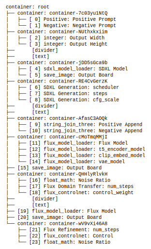

# Explore the workflow API, json schema, and source code

## Useful Information

- terminology and concepts: `context/design/terminology.md`
- client api source code: `src/invokeai_py_client`
- useful information for testing: `context/tasks/info/info-test-data.md`

if you are not sure about the InvokeAI web APIs:
- Look for the demos first: `<workspace>/examples`
- InvokeAI openapi json: `context\hints\invokeai-kb\invokeai-openapi-v6.3.json`, use `jq` for faster search
- InvokeAI API list: `context\hints\invokeai-kb\invokeai-api-list.md`

IMPORTANT:
- how to explore workflow schema: `context\hints\invokeai-kb\howto-find-invokeai-workflow-schema.md`
- official doc about nodes in workflows: `context\refcode\InvokeAI\docs\contributing\INVOCATIONS.md`
- InvokeAI data types: `context\hints\invokeai-kb\about-invokeai-workflow-input-types.md`

## Overview

We are going to explore the workflow API, its JSON schema, and the python source code, in order to implement our `client-api`.

Names of example workflows:
- `sdxl-then-flux.def`: a workflow that combines sdxl and flux to generate image in a multi-stage manner, see `data\workflows\sdxl-flux-refine.json`
- `sdxl-then-flux.query`: the query for the above workflow, see `data\api-calls\call-wf-sdxl-flux-refine.json`, which is what acutally sent to the API `/api/v1/queue/{queue_id}/enqueue_batch`.

### Input and Output of Workflow
- When the workflow is created in GUI, the user selected some of the fields in the `wf-node` (nodes within a workflow), and add them to the `form` field in the workflow definition, these are essentially references to the fields of `wf-node`. These fields in the `form` can be considered as the `input-fields` of the workflow, other fields in the `wf-node` with values are considered as default values, usually NOT supposed to be changed by the user. 
- Some of the `input-fields` are related to output of the workflow, specifying the destination of the output, in particular, output to which `board`. 
- `output-nodes` refer to the `wf-node` of the that has `board` output, for example, the `save_image`or `l2i` node (see `context\refcode\InvokeAI\invokeai\app\invocations\image.py`), which in python has a `WithBoard` mixin, like below. There is another VERY IMPORTANT condition for a node to be an `output-node`, that is, its output board IS specified in the `form` field, that is, belongs to the `input-fields` of the workflow. Otherwise, those nodes are considered as `debug-nodes`

```python
# output node example
@invocation(
    "save_image",
    title="Save Image",
    tags=["primitives", "image"],
    category="primitives",
    version="1.2.2",
    use_cache=False,
)
class SaveImageInvocation(BaseInvocation, WithMetadata, WithBoard):
    """Saves an image. Unlike an image primitive, this invocation stores a copy of the image."""
```

```python
# this is also an output node
@invocation(
    "l2i",
    title="Latents to Image - SD1.5, SDXL",
    tags=["latents", "image", "vae", "l2i"],
    category="latents",
    version="1.3.2",
)
class LatentsToImageInvocation(BaseInvocation, WithMetadata, WithBoard):
    """Generates an image from latents."""
```


- Note that, there is NO such thing as `input-nodes` in the workflow definition, only `input-fields` which are the fields in the `wf-node` that are chosen and added to the `form` field in the workflow definition.

### The `form` field in the workflow definition
- the `form` field in the workflow definition contains many chosen fields that are references to the fields in the nodes of the workflow.
- the `form` field groups those `input-fields` into a hierarchy, many elements have `children` field that contains refs to the lower-level `input-fields` as children (using id), much like a tree structure with pointers.

## Task 1: Understanding Input and Output of Workflow Json definition

Focus on `sdxl-then-flux.def` and `sdxl-then-flux.query`. 

### Task 1.1: Map out the hierarchy of the `form` field in the workflow definition

create a `dot` graph to visualize the hierarchy of the `form` field in the workflow definition, showing the relationships between the `input-fields` and their parent-child structure. For each node in `dot` graph, format its name like this:
- if this is a container, then use `container: <id>`
- if this is a node-field, then use `wf-node.name: <fieldName>`, for the names, always look for a "label" field.

Note that, the `children` are ordered in a list, keep the order, and create you `dot` graph like a dir tree structure. save the graph as `context/tasks/features/task-explore-workflow-1.1.dot`, compile it into `.svg` and link it in this markdown file, only the graphics and a short note, be concise.



*Ordered tree showing form field hierarchy with 39 elements (24 input fields with indices 0-23). Each `node-field` shows its unique `input-index` in brackets [n]. These indices uniquely identify input fields in the workflow.*

[View DOT source](task-explore-workflow-1.1.dot)

### Task 1.2: Finding missing models by name

In the workflow definition, there are some fields that refer to models (dnn model) by name, the name is consistent across different InvokeAI deployments, but the key and hash of the model may differ. Below is an example:

```json
"t5_encoder_model": {
"name": "t5_encoder_model",
"label": "",
"description": "",
"value": {
    "key": "cc644930-283a-464f-b48f-831e6add8ed5",
    "hash": "blake3:38aafa42899cf4fe8b1055d17de6e7fe15af104d193da4a320e34ca24db32754",
    "name": "t5_bnb_int8_quantized_encoder",
    "base": "any",
    "type": "t5_encoder"
}
}
```

Suppose we have InvokeAI system deployed in `127.0.0.1:9090`, now you need to find the model by name, and get its key and hash. Check the `invokeai-api-list.md` for the API to use.

#### Solution

Use the `/api/v2/models/get_by_attrs` endpoint to find models by their name, type, and base attributes:

```bash
# Find T5 encoder model
curl "http://127.0.0.1:9090/api/v2/models/get_by_attrs?name=t5_bnb_int8_quantized_encoder&type=t5_encoder&base=any"

# Find FLUX model
curl "http://127.0.0.1:9090/api/v2/models/get_by_attrs?name=flux1-schnell&type=main&base=flux"
```

Python implementation:
```python
import requests

def find_model_by_name(base_url, model_name, model_type, model_base):
    """Find model's local key and hash by its name"""
    url = f"{base_url}/api/v2/models/get_by_attrs"
    params = {
        "name": model_name,
        "type": model_type,
        "base": model_base
    }
    
    response = requests.get(url, params=params)
    if response.status_code == 200:
        model = response.json()
        return {
            "key": model["key"],        # Local deployment-specific key
            "hash": model["hash"],       # May differ between deployments
            "name": model["name"]        # Consistent across deployments
        }
    return None

# Example: Update workflow with local model keys
model_info = find_model_by_name(
    "http://127.0.0.1:9090",
    "t5_bnb_int8_quantized_encoder",
    "t5_encoder",
    "any"
)
# Returns: {"key": "2dba546f-...", "hash": "blake3:38aa...", "name": "t5_bnb_int8_quantized_encoder"}
```

**Important Notes:**
- Model **names** are consistent across deployments
- Model **keys** and **hashes** are deployment-specific and will differ
- Always query the local InvokeAI instance to get the correct key/hash
- The workflow must be updated with local model references before submission

### Task 1.3: Understanding the `output-nodes` in the workflow definition

An `output-node` must meet TWO conditions:
1. Has `board` output capability (e.g., `save_image` nodes with `WithBoard` mixin)
2. Its board field is exposed in the `form` field as an input-field

Nodes with board output but NOT exposed in form are considered `debug-nodes`.

Now you need to:
- Find all nodes with board output capability
- Identify which ones have their board field exposed in the form
- Distinguish true `output-nodes` from `debug-nodes`
- Map output-nodes to their input-field indices

#### Solution

### Method to Find Output Nodes vs Debug Nodes

1. **Find all nodes with board output capability (WithBoard mixin - e.g., save_image, l2i):**
```bash
# Find all nodes that can output to boards (have WithBoard mixin)
cat data/workflows/sdxl-flux-refine.json | jq '.nodes[] | select(.data.type == "save_image" or .data.type == "l2i") | {id: .id, type: .data.type, label: .data.label}'
```

2. **Check which ones have board field exposed in form:**
```bash
# Find nodes with board field exposed in form
cat data/workflows/sdxl-flux-refine.json | jq '
  .form.elements | to_entries[] | 
  select(.value.type == "node-field") |
  select(.value.data.fieldIdentifier.fieldName == "board") |
  {element_id: .key, node_id: .value.data.fieldIdentifier.nodeId, field: .value.data.fieldIdentifier.fieldName}
'
```

3. **Classify nodes as output-nodes or debug-nodes:**
```python
def classify_board_nodes(workflow_json):
    """Classify nodes with board output as output-nodes or debug-nodes"""
    # Get all nodes with board capability (WithBoard mixin)
    # Common types: save_image, l2i, but could be others
    # To find more: check InvokeAI source for classes with WithBoard mixin
    board_capable_types = ['save_image', 'l2i']  # Extend as more types are discovered
    board_nodes = [n for n in workflow_json['nodes'] 
                   if n['data'].get('type') in board_capable_types]
    
    # Find which have board field exposed in form
    form_elements = workflow_json['form']['elements']
    exposed_board_nodes = set()
    input_index = 0
    output_nodes = []
    
    def traverse(elem_id):
        nonlocal input_index
        elem = form_elements.get(elem_id)
        if elem['type'] == 'container':
            for child_id in elem['data'].get('children', []):
                traverse(child_id)
        elif elem['type'] == 'node-field':
            field_id = elem['data']['fieldIdentifier']
            if field_id['fieldName'] == 'board':
                exposed_board_nodes.add(field_id['nodeId'])
                # Check if it's a board-capable node
                for node in board_nodes:
                    if node['id'] == field_id['nodeId']:
                        output_nodes.append({
                            'input_index': input_index,
                            'node_id': node['id'],
                            'node_label': node['data'].get('label', node['data']['type']),
                            'field': 'board'
                        })
            input_index += 1
    
    traverse('root')
    
    # Classify all board nodes
    debug_nodes = [n for n in board_nodes if n['id'] not in exposed_board_nodes]
    
    return {
        'output_nodes': output_nodes,
        'debug_nodes': debug_nodes
    }
```

### Output Nodes vs Debug Nodes in Workflow

The workflow contains 5 nodes with board output capability (WithBoard mixin):
- 1 `l2i` node (Latents to Image)
- 4 `save_image` nodes

**TRUE OUTPUT-NODES (board field exposed in form):**
- [5] Output Board: save_image(4414d4b5-82c3-4513-8c3f-86d88c24aadc) - SDXL Generation stage
- [15] Output Board: save_image(67e997b2-2d56-43f4-8d2e-886c04e18d9f) - Flux Domain Transfer stage  
- [20] Output Board: save_image(abc466fe-12eb-48a5-87d8-488c8bda180f) - Flux Refinement stage

**DEBUG-NODES (board capability but NOT exposed in form):**
- l2i(cf3922d2-e1bc-40cd-8fcd-2a93708d52c2) - Latents to Image conversion (internal processing)
- save_image(bb95a42f-3f83-4a6f-8111-745fc1c653fa) - HED edge detection intermediate output

**Key findings:**
1. Output-nodes can be ANY node type with WithBoard mixin (not just save_image)
2. Only nodes with BOTH board capability AND board field exposed in form are true output-nodes
3. The 3 output-nodes allow users to configure destination boards at indices [5], [15], [20]
4. Debug-nodes include both l2i and save_image types that save to fixed boards
5. This distinction is critical for the client API to know which outputs are user-facing vs internal debugging
