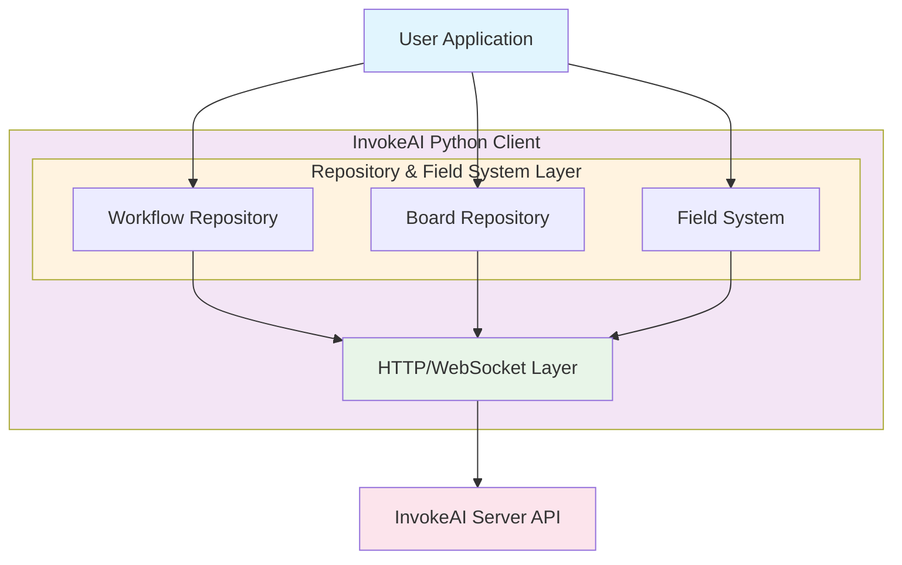
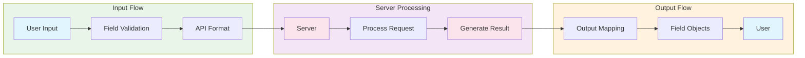
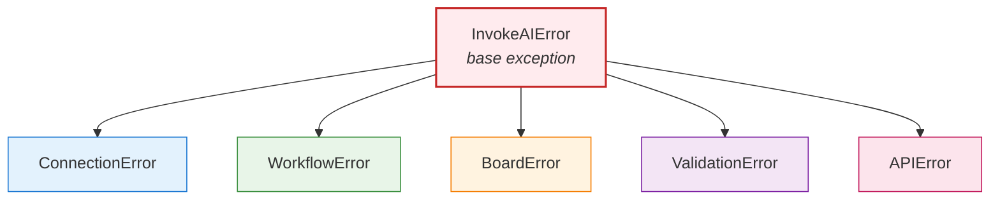

# Architecture

InvokeAI Python Client architecture and design patterns.

## Overview

The client follows a layered architecture with clear separation of concerns:

## Repository Pattern

The client applies the Repository pattern to isolate domain operations from transport and object modeling concerns. Each repository exposes a cohesive set of operations and composes only through stable interfaces:

- WorkflowRepository
  - Role: Bind an immutable workflow definition to a server and return a stateful handle for execution and inspection.
  - Responsibilities: Create workflow handles, scope server communication for a workflow session, perform validation and value-only substitution on submit, map outputs to images.
  - Reference: [Workflow API](../api-reference/workflow.md)

- BoardRepository
  - Role: Provide board lifecycle and image operations decoupled from HTTP details.
  - Responsibilities: List/create/update/delete boards, resolve handles (including uncategorized), orchestrate uploads/downloads and image moves/starring.
  - Reference: [Boards API](../api-reference/boards.md)

- InvokeAIClient
  - Role: Construct and cache repositories, manage HTTP and Socket.IO connectivity, provide low-level request helper for advanced use.
  - Responsibilities: Connection bootstrap ([InvokeAIClient.from_url()](../api-reference/client.md)), health checks, socket session management, request retry configuration.
  - Reference: [Client API](../api-reference/client.md)

## Field Type System

Strongly-typed, default-constructable field classes provide:
- Runtime type safety for inputs discovered from the GUI Form
- Pydantic-backed validation and clean API conversions
- Clear assignment semantics (simple fields use `.value`, structured fields store attributes directly)

Categories (selected):
- Primitive: IvkStringField, IvkIntegerField, IvkFloatField, IvkBooleanField
- Resource: IvkImageField, IvkBoardField, IvkLatentsField, IvkTensorField
- Model: IvkModelIdentifierField, IvkUNetField, IvkCLIPField, IvkTransformerField, IvkLoRAField
- Enum/Choice: IvkEnumField, IvkSchedulerField (with alias normalization)

Design principles:
- Default-constructable classes for robust deserialization and testing
- Strict conversion boundaries via `to_api_format()` / `from_api_format()`
- Maintain concrete type identity post-discovery (no polymorphic swap at runtime)

Reference: [Fields API](../api-reference/fields.md)

## Workflow Execution

End-to-end path (blocking; async variants exist):

1) Definition loading
   - Load exported JSON into an immutable WorkflowDefinition.
   - The JSON is never mutated; it remains the source of truth.

2) Input discovery and mapping
   - Depth‑first (pre‑order) traversal of the Form tree constructs an ordered list of IvkWorkflowInput descriptors.
   - Indices (input_index) are the public, stable handle; labels/names are advisory only.

3) Optional model synchronization
   - Resolve model identifier fields against server inventory (by name/base).
   - Normalizes keys/hashes and ensures availability before execution.

4) Submission (value‑only substitution)
   - Build a graph payload by copying the raw definition and substituting only values for inputs the user changed.
   - Stage uploads for image-like resources when needed (e.g., using BoardHandle).
   - Enqueue via the queue endpoint; return a submission envelope (batch_id, item_ids, session_id).

5) Monitoring
   - Blocking: `submit_sync()` then `wait_for_completion_sync(timeout=...)` (no submission argument required).
   - Async: `await submit(subscribe_events=True)` with event callbacks and `await wait_for_completion(...)`.
   - Hybrid: `submit_sync_monitor_async()` to stream events while using a simple submit path.

6) Output mapping
   - Correlate output-capable nodes (board fields exposed in Form) to produced image names and boards.
   - Provide structured records to enable downstream save/download/organization.

References:
- [WorkflowHandle.submit_sync()](../api-reference/workflow.md)
- [WorkflowHandle.wait_for_completion_sync()](../api-reference/workflow.md)
- [WorkflowHandle.map_outputs_to_images()](../api-reference/workflow.md)
- Async patterns: [Utilities](../api-reference/utilities.md)

## Data Flow

## Error Handling

Hierarchical exception model and mapping to transport failures:

Guidance:
- ValidationError: Raised by per-field validation and workflow-level `validate_inputs()`; aggregate errors by index for actionable feedback.
- APIError: Wraps non-2xx responses from `_make_request(...)`; include status codes and response snippets where available.
- ConnectionError: DNS/timeout/transport issues; recommend retry with backoff.
- WorkflowError: Logical process errors (e.g., missing required inputs, unsupported graph shapes).
- BoardError: Domain-specific image/board problems (membership checks on download, attempts to delete protected boards).

Reliability patterns:
- Prefer repository methods (they raise typed errors) over raw requests.
- Implement bounded retries with exponential backoff on 429/5xx (see recipe in [Utilities](../api-reference/utilities.md)).
- Always set timeouts; treat them as failures that deserve user-visible handling.

## Best Practices

- Immutable definitions
  - Treat exported JSON as read-only; rely on value-only substitution at submit time.
- Stable input access
  - Use indices from depth‑first discovery; snapshot into constants in long-lived scripts.
- Validation upfront
  - Call `validate_inputs()` and surface per-index failures before submit to reduce queue churn.
- Resource hygiene
  - Upload only what you need; delete or move intermediate images to appropriate boards; avoid leaking artifacts.
- Connection reuse
  - Reuse the same `InvokeAIClient.from_url(...)` instance; avoid recreating sessions in loops.
- Monitoring and timeouts
  - Set timeouts consistently; provide user feedback via progress callbacks or events.
- Retry policy
  - Backoff on transient HTTP errors; never retry blindly on logical validation failures.
- Board routing
  - Expose board fields for outputs you care about; otherwise ensure nodes write to a valid fallback (e.g., “none” for uncategorized).
- Async suitability
  - Favor async submission/events for dashboards and concurrent UIs; keep sockets long‑lived via `socketio_session()`.

## Layered Components and Responsibilities

- Client (transport and lifecycle)
  - HTTP: request construction, retries, auth headers
  - Socket.IO: connection lifecycle, path `/ws/socket.io`, subscription helpers
  - Repositories: lazy construction and caching, shared session reuse

- Workflow layer
  - Definition model, discovery, validation, model sync, submission building, queue polling, output mapping
  - No graph surgery; preserves node/edge structure

- Boards layer
  - Board CRUD, handles, uploads/downloads, image moves/star/unstar/delete
  - Guardrails: membership checks before download; uncategorized upload semantics (omit board_id)

## Input Discovery Algorithm and Stability

Deterministic pre-order traversal of the Form container tree:
- Visit containers in definition order, top → bottom.
- Visit child fields of each container in visual order.
- Recurse into nested containers as encountered.

Consequences:
- Indices are stable so long as the Form structure is unchanged.
- Labels and field names are not globally unique or stable—do not use as keys.
- Changing the Form (add/remove/reorder) invalidates old indices; use index map utilities:
  - Export: [WorkflowHandle.export_input_index_map()](../api-reference/utilities.md)
  - Verify: [WorkflowHandle.verify_input_index_map()](../api-reference/utilities.md)

## Submission Pipeline Internals (Blocking Mode)

1) Validate inputs (aggregate errors by index)
2) Resolve models (optional)
3) Stage resources (image uploads via BoardHandle where necessary)
4) Build submission graph (copy + value-only substitution)
5) Enqueue to queue/default
6) Poll status (progress callback optional)
7) On completion, correlate outputs → images using session/queue data and board field indices

See: [Workflow API](../api-reference/workflow.md)

## Socket.IO Event Model (Async/Hybrid)

- Endpoint: same host/port, path `/ws/socket.io`
- Client helper: [InvokeAIClient.socketio_session()](../api-reference/client.md)
- Common events:
  - `queue_item_status_changed` (status transitions)
  - `invocation_progress` (progress 0.0..1.0 per session/invocation)
  - `graph_complete` (terminal signal for a session)

Choose:
- Async UI: subscribe events and await `wait_for_completion(...)`
- Hybrid scripting: `submit_sync_monitor_async()` to process a stream without changing the submit path

## Extensibility Points

- Field detection registry (predicate → builder) to support new field types without if/elif sprawl
- Model sync strategies (by name/base)
- Output-capable node classification (extendable ruleset)
- Drift tooling (export/verify index maps) to guard automation scripts

Cross-reference:
- [Fields API](../api-reference/fields.md)
- [Models API](../api-reference/models.md)

## Performance and Reliability

- Prefer small polling intervals only when necessary; Socket.IO reduces load for long runs
- Warm model caches where beneficial (lightweight “first run” to load heavy models)
- Use connection pooling via the single client; avoid per-iteration client creation
- Apply bounded retries with exponential backoff on 429/5xx; never retry validation failures
- Use “fast preview” settings (fewer steps/low CFG) for UX, then “quality pass” settings

## Threading, Async, and Contexts

- Context manager support for the client to ensure cleanup
- Async Socket.IO sessions should be long-lived for dashboards
- Avoid mixing sync and async randomly; prefer one coherent mode or use the hybrid helper intentionally

References:
- [Client API](../api-reference/client.md)
- [Utilities](../api-reference/utilities.md)

## Versioning and Compatibility

- Workflow JSON captures structure and defaults; keep it versioned alongside automation scripts
- Indices drift when Form layout changes; detect via index map verification before batch runs
- Server compatibility: validate on load and surface incompatibilities early

## Security and Authentication

- API key header support via client constructor parameters
- SSL verification controls for HTTPS deployments (development vs production)
- Principle of least privilege: scope tokens to the minimal server operations required

See: [Client API](../api-reference/client.md)

## Testing Strategy

- Unit tests for field validation and API conversions
- Integration tests for discovery → submission → mapping loops (happy path + failure modes)
- Drift tests using exported index maps (unchanged/moved/missing/new categories)

See also:
- [Testing Guide](testing.md)

## Component Cross-Reference

- Client: [Client API](../api-reference/client.md)
- Workflow: [Workflow API](../api-reference/workflow.md)
- Boards: [Boards API](../api-reference/boards.md)
- Fields: [Fields API](../api-reference/fields.md)
- Models and enums: [Models API](../api-reference/models.md)
- Utilities/patterns: [Utilities](../api-reference/utilities.md)

See [Contributing](contributing.md) for development guidelines.
