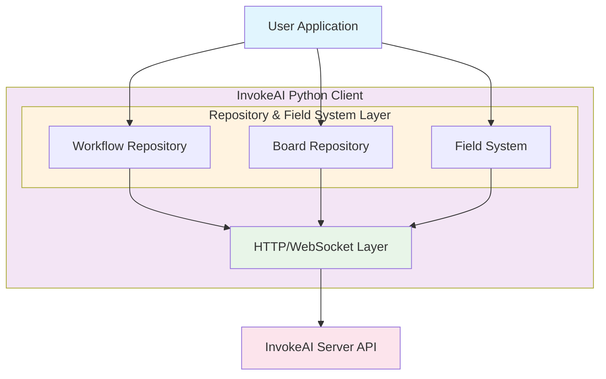
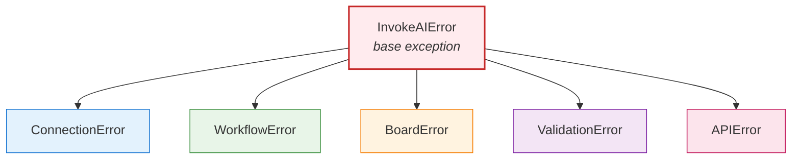

# Architecture

InvokeAI Python Client architecture and design patterns.

## Overview

The client follows a layered architecture with clear separation of concerns:



## Repository Pattern

The client uses the Repository pattern to manage resources:

- **WorkflowRepository**: Manages workflow definitions and handles
- **BoardRepository**: Manages boards and image operations
- **Client**: Orchestrates repositories and manages connections

## Field Type System

Strongly-typed field system with Pydantic validation:

- **IvkField[T]**: Generic base class for all fields
- **Primitive Fields**: String, Integer, Float, Boolean
- **Resource Fields**: Image, Board, Latents, Tensor
- **Model Fields**: ModelIdentifier, UNet, CLIP, etc.

## Workflow Execution

1. **Definition Loading**: Parse workflow JSON
2. **Input Mapping**: Create IvkWorkflowInput instances
3. **Model Sync**: Match models to server availability
4. **Submission**: Send to execution queue
5. **Monitoring**: Poll or stream events
6. **Output Mapping**: Extract results

## Data Flow

```mermaid
flowchart LR
    subgraph Input ["Input Flow"]
        UI[User Input] --> FV[Field Validation]
        FV --> AF[API Format]
        AF --> SRV1[Server]
    end
    
    subgraph Output ["Output Flow"]  
        SRV2[Server Result] --> OM[Output Mapping]
        OM --> FO[Field Objects]
        FO --> USR[User]
    end
    
    style Input fill:#e8f5e8
    style Output fill:#fff3e0
    style UI fill:#e1f5fe
    style USR fill:#e1f5fe
    style SRV1 fill:#fce4ec
    style SRV2 fill:#fce4ec
```

## Error Handling

Hierarchical exception system:



## Best Practices

1. **Immutable Workflows**: Never modify workflow JSON structure
2. **Type Safety**: Use field types for validation
3. **Resource Management**: Clean up uploaded assets
4. **Connection Pooling**: Reuse client instances
5. **Error Recovery**: Implement retry logic

See [Contributing](contributing.md) for development guidelines.
