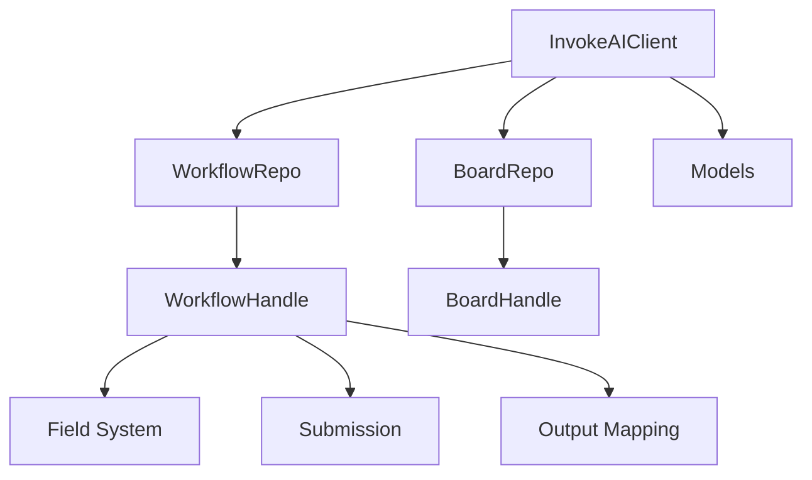
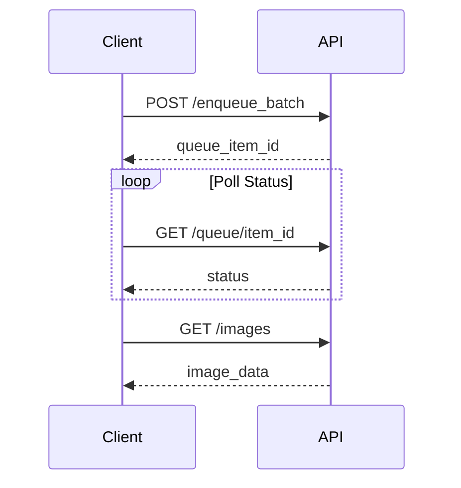

# Developer Guide

Welcome to the InvokeAI Python Client developer documentation. This guide is for contributors and advanced users who want to understand the internals, extend the client, or contribute to the project.

## Guide Overview

<div class="grid cards" markdown>

-   :material-architecture: **[Architecture](architecture.md)**
    
    System design, modules, and data flow

-   :material-github: **[Contributing](contributing.md)**
    
    How to contribute code and documentation

-   :material-test-tube: **[Testing](testing.md)**
    
    Test strategy and writing tests

-   :material-puzzle: **[Extension Points](extensions.md)**
    
    Adding field types and capabilities

-   :material-api: **[Upstream APIs](upstream-apis.md)**
    
    InvokeAI REST API integration

</div>

## Architecture Overview



## Key Components

### Core Modules

| Module | Purpose | Key Classes |
|--------|---------|-------------|
| `client.py` | Connection management | `InvokeAIClient` |
| `workflow/` | Workflow operations | `WorkflowDefinition`, `WorkflowHandle` |
| `ivk_fields/` | Type system | `IvkField`, typed field classes |
| `board/` | Board management | `Board`, `BoardHandle`, `BoardRepository` |
| `models.py` | Data models | `IvkImage`, `IvkJob`, enums |

### Design Patterns

- **Repository Pattern**: Separation of concerns for workflows, boards, models
- **Immutable Workflows**: JSON structure never modified
- **Type Safety**: Strongly-typed fields with Pydantic validation
- **Index-Based Access**: Stable handles for form inputs

## Development Setup

### Prerequisites

- Python 3.9+
- Git
- InvokeAI server for testing

### Environment Setup

```bash
# Clone repository
git clone https://github.com/CodeGandee/invokeai-py-client
cd invokeai-py-client

# Using pixi (recommended)
pixi run dev-setup

# Or using pip
pip install -e ".[dev]"
pre-commit install
```

### Running Tests

```bash
# All tests
pixi run test

# With coverage
pixi run test-cov

# Specific test
python -m pytest tests/test_workflow.py::TestWorkflow::test_discovery
```

## Code Standards

### Python Style

- Follow PEP 8 with Black formatting
- Type hints for all public functions
- Docstrings in Google style

### Commit Messages

Follow conventional commits:

```
feat: add new field type for color selection
fix: correct index calculation for nested containers
docs: update workflow basics guide
test: add coverage for board operations
```

### Pull Request Process

1. Fork and create feature branch
2. Make changes with tests
3. Run quality checks: `pixi run quality`
4. Submit PR with description
5. Address review feedback

## Core Invariants

These principles must be preserved:

!!! danger "Critical Invariants"
    1. **Immutable Workflows**: Never modify original JSON structure
    2. **Index Stability**: Indices are the only stable handles
    3. **Type Consistency**: Field types don't change after discovery
    4. **No Hidden Mutations**: All operations are explicit

## Extension Guide

### Adding a New Field Type

1. Create field class in `ivk_fields/`:

```python
class IvkCustomField(IvkField[str]):
    value: str
    
    def validate_field(self) -> None:
        # Validation logic
        pass
    
    def to_api_format(self) -> Any:
        return {"type": "custom", "value": self.value}
```

2. Register detection predicate:

```python
def detect_custom_field(field_info: dict) -> bool:
    return field_info.get("type") == "CustomField"

def build_custom_field(field_info: dict) -> IvkCustomField:
    return IvkCustomField(value=field_info.get("value", ""))

# Register
field_registry.register(detect_custom_field, build_custom_field)
```

3. Add tests in `tests/test_fields.py`

### Adding Output Node Support

Extend output classification in `workflow_handle.py`:

```python
def is_output_capable(node: dict) -> bool:
    node_type = node.get("type", "")
    return node_type in [
        "save_image",
        "l2i",  # latents to image
        "custom_output"  # Your new type
    ]
```

## Testing Strategy

### Test Categories

| Category | Purpose | Location |
|----------|---------|----------|
| Unit | Individual components | `tests/test_*.py` |
| Integration | Component interaction | `tests/integration/` |
| E2E | Full workflows | `examples/` scripts |

### Writing Tests

```python
import pytest
from invokeai_py_client import InvokeAIClient

class TestWorkflow:
    @pytest.fixture
    def client(self):
        return InvokeAIClient.from_url("http://localhost:9090")
    
    def test_discovery(self, client):
        wf = client.workflow_repo.create_workflow(...)
        inputs = list(wf.list_inputs())
        assert len(inputs) > 0
        assert inputs[0].input_index == 0
```

## API Integration

### Key Endpoints

| Operation | Endpoint | Client Method |
|-----------|----------|---------------|
| Submit workflow | `/api/v1/queue/{queue_id}/enqueue_batch` | `wf.submit_sync()` |
| Get queue status | `/api/v1/queue/{queue_id}/i/{item_id}` | `wf.wait_for_completion_sync()` |
| List boards | `/api/v1/boards/` | `board_repo.list_boards()` |
| Upload image | `/api/v1/images/upload` | `board.upload_image_file()` |
| Download image | `/api/v1/images/i/{name}/full` | `board.download_image()` |

### Request Flow



## Performance Considerations

### Optimization Tips

1. **Batch Operations**: Group multiple workflows
2. **Connection Pooling**: Reuse client instances
3. **Async Execution**: Use async methods for concurrency
4. **Index Caching**: Store indices after discovery

### Benchmarking

```python
import time

def benchmark_workflow(wf, iterations=10):
    times = []
    for _ in range(iterations):
        start = time.time()
        wf.submit_sync()
        result = wf.wait_for_completion_sync()
        times.append(time.time() - start)
    
    avg = sum(times) / len(times)
    print(f"Average: {avg:.2f}s")
```

## Debugging

### Enable Debug Logging

```python
import logging

logging.basicConfig(level=logging.DEBUG)
logger = logging.getLogger('invokeai_py_client')
```

### Common Issues

| Issue | Debug Steps |
|-------|-------------|
| Field not found | Print `wf.list_inputs()` output |
| Submission fails | Check server logs, validate JSON |
| Output mapping empty | Verify board fields in Form |

## Resources

- [Architecture Details](architecture.md)
- [Contributing Guide](contributing.md)
- [API Documentation](../api-reference/index.md)
- [InvokeAI OpenAPI Spec](https://github.com/invoke-ai/InvokeAI/blob/main/openapi.json)

## Getting Help

- GitHub Issues: [Report bugs](https://github.com/CodeGandee/invokeai-py-client/issues)
- Discussions: [Ask questions](https://github.com/CodeGandee/invokeai-py-client/discussions)
- Discord: Join the InvokeAI community