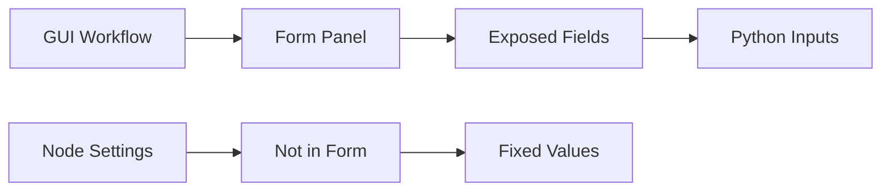

# Core Concepts

Understanding these key concepts will help you use the InvokeAI Python Client effectively.

## Workflow Definition

A **WorkflowDefinition** is the JSON representation of a workflow exported from the InvokeAI GUI. It contains:

- **Nodes**: Processing units (models, prompts, samplers, etc.)
- **Edges**: Connections between nodes
- **Form**: User-configurable parameters

```python
from invokeai_py_client.workflow import WorkflowDefinition

# Load from file
workflow_def = WorkflowDefinition.from_file("my-workflow.json")

# The definition is immutable - it's never modified
print(f"Workflow: {workflow_def.meta.get('name')}")
print(f"Nodes: {len(workflow_def.nodes)}")
```

!!! info "Immutability Principle"
    The client treats workflow JSON as immutable. When you set values and submit, only the values are substituted - the graph structure never changes.

## Form-Based Input Discovery

The **Form** is the key to programmable workflows. Only fields added to the Form panel in the GUI are accessible from Python.



### Why Forms Matter

- **Form fields** = Programmable inputs
- **Non-form values** = Fixed in the workflow
- **Best practice**: Add all parameters you want to control to the Form

## Index-Based Access

The client uses **indices** as the primary way to access inputs. Indices are determined by depth-first traversal of the Form structure.

### Index Discovery

```python
# List all inputs with their indices
for inp in wf.list_inputs():
    print(f"[{inp.input_index:2d}] {inp.label or inp.field_name}")

# Output:
# [ 0] Positive Prompt
# [ 1] Negative Prompt  
# [ 2] Width
# [ 3] Height
```

### Why Indices?

- **Stability**: Indices don't change unless you restructure the Form
- **Uniqueness**: Always unique, unlike labels or field names
- **Performance**: Direct array access is fast

### Index Ordering Rules

The traversal follows these rules:

1. Visit containers in order of appearance
2. Within each container, visit fields top-to-bottom
3. Recursively enter nested containers

```
Form Structure:          Indices:
├── Prompt               [0]
├── Negative Prompt      [1]
├── Container
│   ├── Width            [2]
│   └── Height           [3]
└── Steps                [4]
```

## Typed Field System

Every input has a strongly-typed field class that provides validation and type safety.

### Field Types

| Field Class | Purpose | Value Type |
|------------|---------|------------|
| `IvkStringField` | Text inputs | `str` |
| `IvkIntegerField` | Whole numbers | `int` |
| `IvkFloatField` | Decimal numbers | `float` |
| `IvkBooleanField` | Checkboxes | `bool` |
| `IvkImageField` | Image references | `str` (name) |
| `IvkBoardField` | Board selection | `str` (id) |
| `IvkModelIdentifierField` | Model selection | Complex |

### Working with Fields

```python
# Get a field by index
field = wf.get_input_value(0)

# Check if it has a value property
if hasattr(field, 'value'):
    # Set the value with type checking
    field.value = "New prompt text"
    
# Fields validate on assignment
try:
    int_field.value = "not a number"  # Raises ValidationError
except ValueError as e:
    print(f"Invalid value: {e}")
```

## Workflow Handle

A **WorkflowHandle** is your interface to a loaded workflow. It provides methods to:

- List and access inputs
- Set values
- Submit for execution
- Track progress
- Map outputs

```python
# Create a handle from a definition
wf = client.workflow_repo.create_workflow(workflow_def)

# The handle maintains state
wf.get_input_value(0).value = "New value"  # State is kept

# Submit creates a new execution
submission = wf.submit_sync()
```

## Execution Model

The client supports multiple execution modes:

### Synchronous (Blocking)

```python
# Submit and wait in sequence
submission = wf.submit_sync()
result = wf.wait_for_completion_sync(timeout=120)
```

### Asynchronous

```python
# Submit without blocking
async def run_async():
    submission = await wf.submit()
    # Do other work...
    result = await wf.wait_for_completion()
```

### With Progress Monitoring

```python
# Track progress during execution
def on_progress(queue_item):
    print(f"Status: {queue_item.get('status')}")
    print(f"Progress: {queue_item.get('progress_percentage')}%")

result = wf.wait_for_completion_sync(
    timeout=180,
    progress_callback=on_progress
)
```

## Output Mapping

After execution, the client maps output nodes to the images they produced.

### Understanding Outputs

An "output" is a node that:
1. Can save images to a board
2. Has its board field exposed in the Form

### Mapping Process

```python
# Get mappings after completion
mappings = wf.map_outputs_to_images(queue_item)

# Each mapping contains:
# - node_id: The output node
# - board_id: Where images were saved  
# - image_names: List of produced images
# - input_index: Form index (if exposed)

for m in mappings:
    print(f"Node {m['node_id']} produced {m.get('image_names')}")
```

## Board Management

Boards organize images in InvokeAI. The client provides full board control:

### Board Operations

```python
# List all boards
boards = client.board_repo.list_boards(include_uncategorized=True)

# Get a board handle
board = client.board_repo.get_board_handle("board_id")

# Upload an image
image_name = board.upload_image_file("input.png")

# Download an image
data = board.download_image("image_name.png", full_resolution=True)
```

### Special "none" Board

The uncategorized board uses the ID `"none"` (string, not Python None):

```python
# Access uncategorized images
uncategorized = client.board_repo.get_board_handle("none")
images = uncategorized.list_images()
```

## Model Synchronization

Workflows may reference models that don't exactly match server records. The client can synchronize these:

```python
# Sync model references before submission
changes = wf.sync_dnn_model(
    field_indices=[0],  # Model field index
    by_name=True,       # Match by model name
    by_base=True        # Fall back to base model
)

# Changes show what was updated
for old, new in changes:
    print(f"Updated: {old} -> {new}")
```

## Design Principles

The client follows these core principles:

### 1. Immutable Workflows
- Original JSON is never modified
- Only values are substituted at submission
- Graph structure remains exactly as designed

### 2. Index-Based Stability
- Indices are the authoritative way to access inputs
- Labels and names are for display only
- Indices stay stable until Form restructuring

### 3. Type Safety
- Every field has a concrete type
- Validation happens on assignment
- No dynamic type changes after discovery

### 4. Explicit Operations
- No hidden mutations or side effects
- Clear method names and return values
- Predictable error handling

## Common Patterns

### Pattern: Snapshot Indices

```python
# After discovering inputs once, snapshot the indices
IDX_PROMPT = 0
IDX_NEGATIVE = 1
IDX_WIDTH = 2
IDX_HEIGHT = 3
IDX_STEPS = 4

# Use throughout your script
wf.get_input_value(IDX_PROMPT).value = "New prompt"
wf.get_input_value(IDX_STEPS).value = 30
```

### Pattern: Batch Processing

```python
# Process multiple inputs through the same workflow
for item in dataset:
    # Set inputs
    wf.get_input_value(IDX_PROMPT).value = item['prompt']
    wf.get_input_value(IDX_WIDTH).value = item['width']
    
    # Submit and track
    submission = wf.submit_sync()
    result = wf.wait_for_completion_sync()
    
    # Store results
    item['result'] = wf.map_outputs_to_images(result)
```

### Pattern: Safe Field Access

```python
def set_field_safely(wf, index, value):
    """Set a field value with error handling"""
    try:
        field = wf.get_input_value(index)
        if hasattr(field, 'value'):
            field.value = value
            return True
        else:
            print(f"Field {index} has no value property")
            return False
    except IndexError:
        print(f"No field at index {index}")
        return False
    except ValueError as e:
        print(f"Invalid value for field {index}: {e}")
        return False
```

## Next Steps

Now that you understand the core concepts:

- Explore the [User Guide](../user-guide/index.md) for detailed feature documentation
- Check out [Examples](../examples/index.md) for complete working code
- Review the [API Reference](../api-reference/index.md) for method details
- Learn about [Field Types](../user-guide/field-types.md) for different input handling