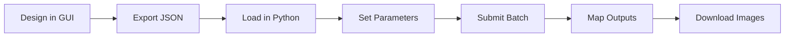

# Getting Started

Welcome to the InvokeAI Python Client! This guide will help you get up and running quickly.

## Overview

The InvokeAI Python Client enables you to:

1. **Export workflows** from the InvokeAI GUI
2. **Load them** in Python with full type safety
3. **Set parameters** programmatically
4. **Execute** at scale with batch processing
5. **Map outputs** to generated images

## Prerequisites

Before you begin, ensure you have:

- [x] Python 3.9 or higher
- [x] [InvokeAI](https://github.com/invoke-ai/InvokeAI) server running (default: http://localhost:9090)
- [x] A workflow exported from the InvokeAI GUI

## Quick Navigation

-   :material-download: **[Installation](installation.md)**

    Set up the client in your environment

-   :material-rocket: **[Quick Start](quickstart.md)**

    Run your first workflow in 5 minutes

-   :material-school: **[Core Concepts](concepts.md)**

    Understand the key ideas behind the client

## Typical Workflow

## What's Next?

Start with [Installation](installation.md) to set up the client, then follow the [Quick Start](quickstart.md) guide to run your first workflow.

For a deeper understanding of how the client works, read [Core Concepts](concepts.md).