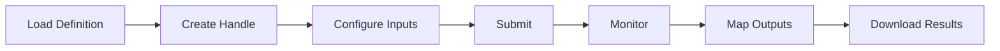

# Workflow Basics

Learn how to load, manage, and execute workflows with the InvokeAI Python Client.

## What is a Workflow?

A workflow in InvokeAI is a graph of connected nodes that process data to generate images. When you design a workflow in the GUI, you're creating:

- **Nodes**: Processing units (prompts, models, samplers, etc.)
- **Edges**: Data connections between nodes
- **Form**: User-configurable parameters

## Loading Workflows

### From File

```python
from invokeai_py_client import InvokeAIClient
from invokeai_py_client.workflow import WorkflowDefinition

# Load workflow definition
workflow_def = WorkflowDefinition.from_file("my-workflow.json")

# Create client and workflow handle
client = InvokeAIClient.from_url("http://localhost:9090")
wf = client.workflow_repo.create_workflow(workflow_def)
```

### From JSON String

```python
import json

# Load from string
with open("workflow.json", "r") as f:
    json_str = f.read()
    
workflow_def = WorkflowDefinition.from_json(json_str)
```

### From Dictionary

```python
# Load from dict
workflow_dict = {
    "meta": {"name": "My Workflow"},
    "nodes": [...],
    "edges": [...],
    "form": [...]
}

workflow_def = WorkflowDefinition.from_dict(workflow_dict)
```

## Workflow Structure

### Meta Information

Access workflow metadata:

```python
# Get workflow info
print(f"Name: {workflow_def.meta.get('name')}")
print(f"Version: {workflow_def.meta.get('version')}")
print(f"Description: {workflow_def.meta.get('description')}")
print(f"Node count: {len(workflow_def.nodes)}")
print(f"Edge count: {len(workflow_def.edges)}")
```

### Nodes and Edges

The workflow graph consists of:

```python
# Examine nodes
for node_id, node_data in workflow_def.nodes.items():
    node_type = node_data.get('type')
    print(f"Node {node_id}: {node_type}")

# Examine connections
for edge in workflow_def.edges:
    source = edge.get('source', {})
    dest = edge.get('destination', {})
    print(f"Connection: {source.get('node_id')} -> {dest.get('node_id')}")
```

## The Form Panel

The Form is the key to programmable workflows. Only fields in the Form are accessible from Python.

### Form Structure

```python
# List form containers and fields
def explore_form(form_items, depth=0):
    for item in form_items:
        indent = "  " * depth
        if item.get('type') == 'container':
            print(f"{indent}Container: {item.get('label')}")
            explore_form(item.get('children', []), depth + 1)
        else:
            print(f"{indent}Field: {item.get('label')}")

explore_form(workflow_def.form)
```

### Why Form Matters

- **Form fields** → Programmable inputs
- **Non-form values** → Fixed in workflow
- **Best practice**: Add all parameters you want to control to the Form

## Creating Workflow Handles

A WorkflowHandle is your interface to execute and manage a workflow:

```python
# Create handle from definition
wf = client.workflow_repo.create_workflow(workflow_def)

# The handle provides methods for:
# - Listing inputs
# - Setting values
# - Submitting execution
# - Tracking progress
# - Mapping outputs
```

## Workflow Lifecycle



## Basic Workflow Operations

### List Available Inputs

```python
# Discover all inputs
inputs = list(wf.list_inputs())
print(f"Found {len(inputs)} inputs")

for inp in inputs:
    print(f"[{inp.input_index}] {inp.label or inp.field_name}")
    print(f"  Type: {type(inp.field).__name__}")
    print(f"  Required: {inp.required}")
```

### Set Input Values

```python
# Set values by index
prompt_field = wf.get_input_value(0)
if hasattr(prompt_field, 'value'):
    prompt_field.value = "A beautiful landscape"

# Set multiple values
wf.get_input_value(1).value = "blurry, low quality"  # negative
wf.get_input_value(2).value = 1024  # width
wf.get_input_value(3).value = 1024  # height
```

### Submit Workflow

```python
# Submit synchronously
submission = wf.submit_sync()
print(f"Submitted: {submission}")

# Wait for completion
result = wf.wait_for_completion_sync(timeout=120)
print(f"Status: {result.get('status')}")
```

## Workflow Validation

Before submission, validate inputs:

```python
# Validate all inputs
try:
    wf.validate_inputs()
    print("✓ All inputs valid")
except ValueError as e:
    print(f"✗ Validation failed: {e}")

# Check specific field
field = wf.get_input_value(0)
try:
    field.validate_field()
    print(f"✓ Field valid")
except ValueError as e:
    print(f"✗ Field invalid: {e}")
```

## Workflow Immutability

The client treats workflows as immutable:

```python
# Original definition is never modified
original = workflow_def.to_dict()

# Setting values doesn't change the definition
wf.get_input_value(0).value = "New value"

# Definition remains unchanged
assert workflow_def.to_dict() == original

# Only submission creates a modified copy
submission_data = wf._build_submission()  # Internal method
```

## Model Synchronization

Ensure models in your workflow match the server:

```python
# Sync all model fields
changes = wf.sync_dnn_model(
    by_name=True,  # Match by model name
    by_base=True   # Fall back to base model
)

# Show what changed
for old_value, new_value in changes:
    print(f"Updated: {old_value} -> {new_value}")
```

## Workflow State Management

The workflow handle maintains state:

```python
# State is preserved between operations
wf.get_input_value(0).value = "First value"
print(wf.get_input_value(0).value)  # "First value"

# Create new handle for independent state
wf2 = client.workflow_repo.create_workflow(workflow_def)
wf2.get_input_value(0).value = "Different value"

# Original handle unchanged
print(wf.get_input_value(0).value)  # Still "First value"
```

## Error Handling

Handle common workflow errors:

```python
try:
    # Submit workflow
    submission = wf.submit_sync()
    result = wf.wait_for_completion_sync(timeout=180)
    
    if result.get('status') == 'completed':
        print("Success!")
    elif result.get('status') == 'failed':
        error = result.get('error_reason')
        print(f"Workflow failed: {error}")
    elif result.get('status') == 'canceled':
        print("Workflow was canceled")
        
except TimeoutError:
    print("Workflow timed out")
except ConnectionError as e:
    print(f"Connection error: {e}")
except Exception as e:
    print(f"Unexpected error: {e}")
```

## Advanced Features

### Workflow Metadata

```python
# Add custom metadata
workflow_def.meta['custom_field'] = 'custom_value'
workflow_def.meta['version'] = '1.0.0'
workflow_def.meta['author'] = 'Your Name'
```

### Workflow Comparison

```python
# Compare two workflows
def compare_workflows(wf1, wf2):
    # Compare structure
    nodes_match = set(wf1.nodes.keys()) == set(wf2.nodes.keys())
    edges_match = len(wf1.edges) == len(wf2.edges)
    
    # Compare form
    form_fields1 = [f for f in wf1.list_inputs()]
    form_fields2 = [f for f in wf2.list_inputs()]
    form_match = len(form_fields1) == len(form_fields2)
    
    return {
        'nodes_match': nodes_match,
        'edges_match': edges_match,
        'form_match': form_match
    }
```

### Workflow Export

```python
# Export modified workflow
def export_with_defaults(wf, output_file):
    # Get current values
    defaults = {}
    for inp in wf.list_inputs():
        field = wf.get_input_value(inp.input_index)
        if hasattr(field, 'value'):
            defaults[inp.input_index] = field.value
    
    # Save with defaults
    export_data = {
        'workflow': wf.definition.to_dict(),
        'defaults': defaults
    }
    
    with open(output_file, 'w') as f:
        json.dump(export_data, f, indent=2)
```

## Best Practices

### 1. Workflow Organization

- Keep workflow files version controlled
- Document input indices
- Use descriptive workflow names

### 2. Error Recovery

```python
def run_with_retry(wf, max_retries=3):
    for attempt in range(max_retries):
        try:
            submission = wf.submit_sync()
            return wf.wait_for_completion_sync(submission)
        except Exception as e:
            if attempt == max_retries - 1:
                raise
            print(f"Attempt {attempt + 1} failed: {e}")
            time.sleep(5)
```

### 3. Input Documentation

```python
# Document your workflow inputs
WORKFLOW_INPUTS = {
    0: "positive_prompt",
    1: "negative_prompt", 
    2: "width",
    3: "height",
    4: "steps",
    5: "cfg_scale"
}

# Use documented names
wf.get_input_value(WORKFLOW_INPUTS[0]).value = "prompt text"
```

## Troubleshooting

### Workflow Won't Load

```python
# Check file exists and is valid JSON
import os
import json

def validate_workflow_file(filepath):
    if not os.path.exists(filepath):
        return False, "File not found"
    
    try:
        with open(filepath, 'r') as f:
            data = json.load(f)
        
        # Check required fields
        if 'nodes' not in data:
            return False, "Missing nodes"
        if 'edges' not in data:
            return False, "Missing edges"
            
        return True, "Valid"
    except json.JSONDecodeError as e:
        return False, f"Invalid JSON: {e}"
```

### No Inputs Found

- Ensure fields are added to Form in GUI
- Re-export workflow after changes
- Check Form structure in JSON

### Model Errors

- Run `sync_dnn_model()` before submission
- Verify models are installed on server
- Check model names match exactly

## Next Steps

- Learn about [Working with Inputs](inputs.md)
- Explore [Field Types](field-types.md)
- Understand [Execution Modes](execution-modes.md)
- Master [Output Mapping](output-mapping.md)